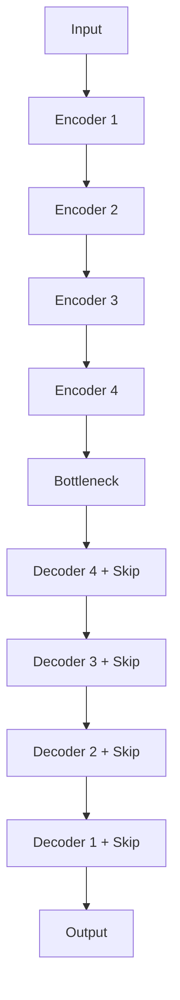
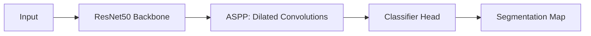

# ML_Projects

## Purpose

The purpose of this repository is to summarize my ML progression, from training DNNs on the CIFAR-10 data to training segmentation-based CNN models on the Oxford-IIIT dataset.

## Architecture Overview

This repository contains implementations of several segmentation architectures for image-based learning tasks, including U-Net and DeepLabV3. These models are designed for dense prediction, where the goal is to assign a label to every pixel in an input image.

## U-Net Architecture

The U-Net implementation follows the standard encoder-decoder structure with skip connections between matching stages. In this repository, the feature-channel count was scaled by a factor of four at each layer, which substantially increases model capacity compared to a baseline U-Net configuration. In effect, this makes the feature representation roughly 16x larger at the corresponding layers than the standard setup.

Key characteristics:
- Encoder path with repeated convolution blocks and downsampling
- Bottleneck that captures a compact latent representation
- Decoder path with upsampling and skip connections for spatial detail recovery
- Output head that produces a pixel-wise segmentation mask

Reference:
- Ronneberger, O., Fischer, P., and Brox, T. "U-Net: Convolutional Networks for Biomedical Image Segmentation."

## DeepLabV3 Architecture

The DeepLabV3 implementation uses atrous (dilated) convolutions and an Atrous Spatial Pyramid Pooling (ASPP) module to capture multi-scale context without reducing spatial resolution. This makes it well suited for semantic segmentation tasks where both local detail and global context matter.

Key characteristics:
- Atrous convolutions with configurable dilation rates
- ASPP module for multi-scale context aggregation
- Final classifier head that produces the segmentation map
- Compatible with a ResNet50 backbone for feature extraction

Reference:
- Chen, L.-C., Papandreou, G., Schroff, F., and Adam, H. "Rethinking Atrous Convolution for Semantic Image Segmentation" (the canonical DeepLabV3 paper).

## ResNet50 Backbone

The ResNet50 backbone is used as a strong feature extractor for the segmentation pipelines in this repository. Its residual blocks improve optimization in very deep networks and enable effective learning of hierarchical visual features.

Key characteristics:
- Deep residual learning framework
- Identity shortcut connections
- Better gradient flow for deeper architectures
- Commonly used as a pretrained encoder for segmentation models

Reference:
- He, K., Zhang, X., Ren, S., and Sun, J. "Deep Residual Learning for Image Recognition."

## Recent Updates and Added Functionality

Recent additions to this repository include supporting functions for model training, evaluation, inference, and visualization. These updates make the segmentation workflows easier to run and extend while keeping the architecture implementations documented above at the center of the project.

Examples of added functionality include:
- Training and evaluation helpers for the segmentation pipelines
- Visualization utilities for model outputs
- Supporting functions for dataset handling and model preparation
- Additional utilities that improve the end-to-end workflow for U-Net and DeepLabV3 experiments

## Training Pipelines

Use the following commands to run the training and evaluation pipelines.

- Run basic model evaluation:
  - `python -m training.basic_evaluate`
- Run CNN model evaluation:
  - `python -m training.cnn_evaluate`
- Train the basic DNN model:
  - `python -m training.basic_train`
- Train the CNN model:
  - `python -m training.cnn_train`
- Train the U-Net segmentation model:
  - `python -m training.unet_train`
- Evaluate the U-Net segmentation model:
  - `python -m training.unet_evaluate`
- Evaluate the DeepLabV3 segmentation model:
  - `python -m training.deeplabV3_evaluate`

After running the U-Net or DeepLabV3 evaluation scripts, you should expect result plots to appear in the Results folder. These include performance charts such as Dice score, IoU, accuracy, and loss, as well as related visualization outputs.

## Data

To train the custom CNN model on cat and dog images:

1. Create the `data/` directory in the project root if it doesn't exist:
   - `mkdir data`
2. Download the dataset from [Microsoft's PetImages dataset](https://www.microsoft.com/en-us/download/details.aspx?id=54765)
3. Extract the downloaded files into the `data/` directory

## Visualization

Use these commands to run visualization scripts.

- Visualize generic outputs:
  - `python -m visualization.visualization`
- Visualize U-Net segmentation results:
  - `python -m visualization.unet_seg_visualization`

